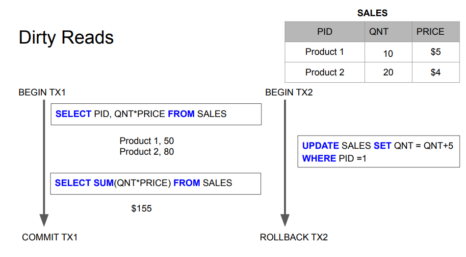
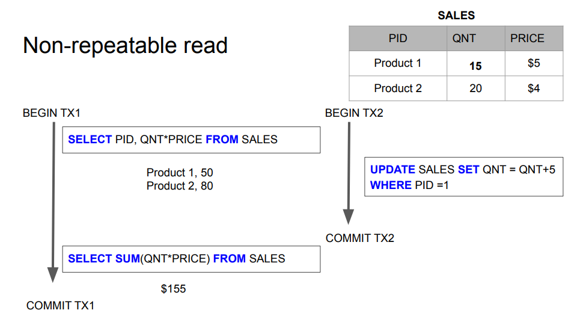
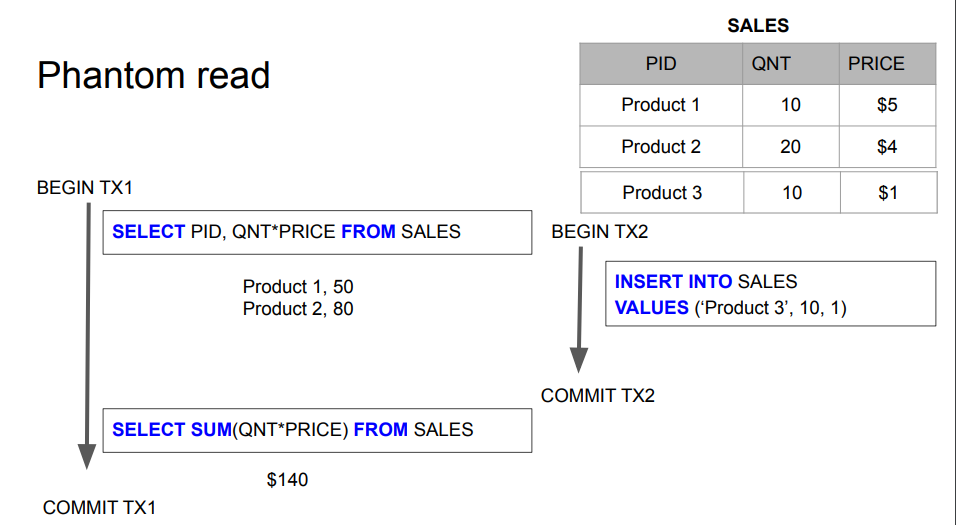
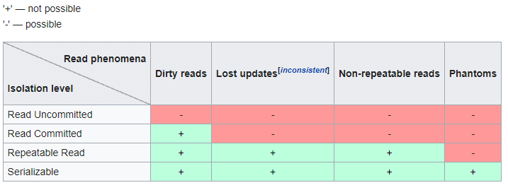

# ACID
4 properties of RDBs - atomicity, consistency isolation, durability

**transaction** - collection of queries that will run within one unit of work. This is used to ensure atomicity of business operation
* begin
* commit
* rollback

e.g. transfer money

**Account**

account_id | balance
----------|--------
1         | $1000
2         | $500

```
begin tx1
select balance from account where id=1
if > 100
update account set balance = balance - 100 where id =1
update account set balance = balance + 100 where id =2
commit tx1
```
### Atomicity 
all queries from transaction must succeed. If one fails all should rollback.

If not atomicity, in example from above if we have a crash - data will be in inconsistent state (like money subtracted and not added to other account)

### Isolation 
isolation - can my transaction see changes made by other transactions?

#### read phenomena
* **dirty reads** - we see **uncommitted** changes made by other transactions. This can be rolled-back. SOmetimes we don't want exact number of stuff (instagram likes)

* **non-repeatable reads** - read some value, but when did it again within the same transaction - got different result. Other transaction changed that - and committed!
Same as before, but committed

* **phantom reads** - other transaction inserted a row in case of double read. 


additionally:

**lost update** - i started to change something and other transaction overwrote my data before I committed

#### isolation levels
levels implemented by DB to fix read phenomenas

* **read uncommitted** - no isolation, any change from the outside is visible to us. All phenomenas present
* **read committed** - each query in transaction sees only committed stuff (at a time of each query). This is the best tradeoff.
 **We can see changes committed at the time of each query**
* **repeatable read** - each query in a transaction only sees committed updates at the beginning of the transaction. 
Sees committed stuff at the beginning of the transaction (not by each query!). **We can see changes committed BEFORE this transaction**   
* **serialized** - transactions are serialized. SLOW!




### Consistency 
* `consistency in data` - all constraints on tables are still obligatory
* `consistency in reads` - update X, read X - always get the same data as you wrote it. 
    * opposite - NoSQL got `eventual consistency` - reads are not always 100% correct, but they will be in future. (data replication propagation, network latency etc.)
    * horizontal scaling might screw this property

#### eventual consistency


### Durability
* persistency on non-volatile storage


## Normalization
https://en.wikipedia.org/wiki/Database_normalization

way to keep data independent of another. Summarize in 
**does this column really belong to this table?**

Sometimes we violate this for peformance.

