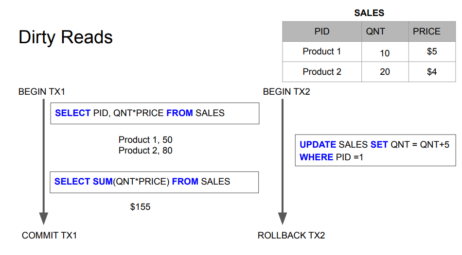
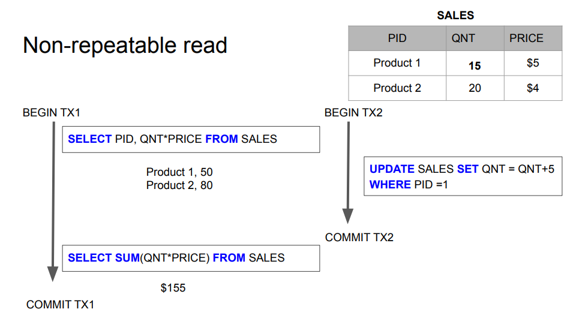
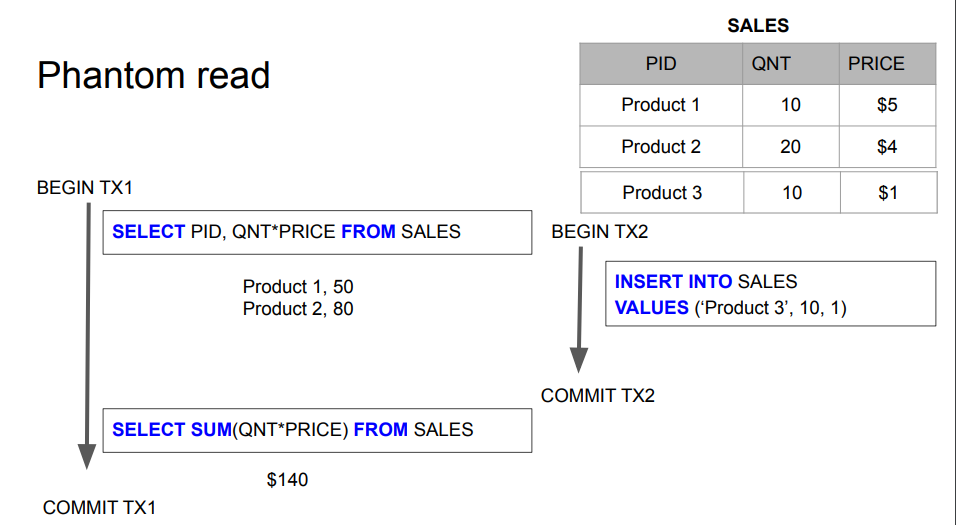
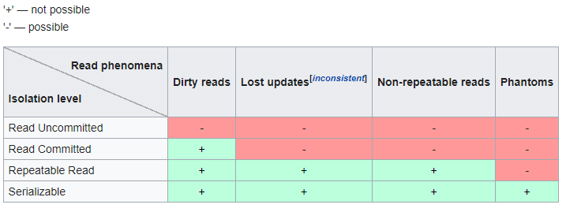

# ACID
4 properties of RDBs - atomicity, consistency isolation, durability

**transaction** - collection of queries that will run within one unit of work. This is used to ensure atomicity of business operation
* begin
* commit
* rollback

e.g. transfer money

**Account**

account_id | balance
----------|--------
1         | $1000
2         | $500

```
begin tx1
select balance from account where id=1
if > 100
update account set balance = balance - 100 where id =1
update account set balance = balance + 100 where id =2
commit tx1
```
### Atomicity 
all queries from transaction must succeed. If one fails all should rollback.

If not atomicity, in example from above if we have a crash - data will be in inconsistent state (like money subtracted and not added to other account)

### Isolation 
isolation - can my transaction see changes made by other transactions?

#### read phenomena
* **dirty reads** - we see **uncommitted** changes made by other transactions. This can be rolled-back. SOmetimes we don't want exact number of stuff (instagram likes)

* **non-repeatable reads** - read some value, but when did it again within the same transaction - got different result. Other transaction changed that - and committed!
Same as before, but committed

* **phantom reads** - other transaction inserted a row in case of double read. 


additionally:

**lost update** - i started to change something and other transaction overwrote my data before I committed

#### isolation levels
levels implemented by DB to fix read phenomenas

* **read uncommitted** - no isolation, any change from the outside is visible to us. All phenomenas present
* **read committed** - each query in transaction sees only committed stuff (at a time of each query). This is the best tradeoff.
 **We can see changes committed at the time of each query**
* **repeatable read** - each query in a transaction only sees committed updates at the beginning of the transaction. 
Sees committed stuff at the beginning of the transaction (not by each query!). **We can see changes committed BEFORE this transaction**   
* **serialized** - transactions are serialized. SLOW!




### Consistency 
* `consistency in data` - all constraints on tables are still obligatory
* `consistency in reads` - update X, read X - always get the same data as you wrote it. 
    * opposite - NoSQL got `eventual consistency` - reads are not always 100% correct, but they will be in future. (data replication propagation, network latency etc.)
    * horizontal scaling might screw this property

#### eventual consistency


### Durability
* persistency on non-volatile storage


# Normalization
https://en.wikipedia.org/wiki/Database_normalization

way to keep data independent of another. Summarize in 
**does this column really belong to this table?**

Sometimes we violate this for peformance.

# Indexing

structure that makes queries faster. Inserts (or updates on indexed column) are slower.

2 types of indexes - **b tree** and **LSM tree**
* b trees might be slow when inserting (rebalancing trees)
* lsm are good for lots of inserts, faster in such cases

`explain analyze select * from employees where id = 2000;`
will give us some info about the query, analyzing performance. Sequential scan (full table scan) - super slow, one by one

execute the query 2 times - cache will get involved (db or ssd cache), so it's faster.

primary key is always indexed by default. By hand:
`create index employees_name on employees(name);`

`like '%asd%;` queries are always slow, even when indexed

### explain - info about query (estimations)
* read the output from most indented directive
* **seq scan** (full table scan) - full table, row by row
* **index scan** - use index to speed up the process
* index only scan - no table fetch, pure index
* **bitmap index scan** - combination of seq scan and index scan. Might slow down everything, doubling the work
* cost - how many ms took to fetch first and all rows. Sometimes we need lot of calculations before starting fetching
* rows - aproximation how many rows will be fetched - can be used instead of count(*)
* width of selected - in bytes (might be average)


### explain analyze - does actual query, no estimation

## indexing

table:
```
create table grades (
    id long primary key,
    name varchar(30),
    g integer
);

create index g_idx on grades(g);
select name from grades where g = 30;
```

This will be **slower** than the same query without idx!!! We still need to go through index AND table! We filtered through g (index), and selected names (actual table). Here even full table scan would be better.

note: where id = someID - this will be fast (index scan), even if we fetch something outside the idx. Also, optimizer might choose different thing

We can create an index on non key columns to fix it. 
Index on data that is frequently fetched with a query. This will increase size of index of course
`create index g_idx on grades (g) include (name);`

now we'll have an index only scan (sweet!)

on ... - what we're searching for, include - what we're selecting

-----------------------
```
create table test (
    a int,
    b int,
    c int
);

create index on test(a);
create index on test(b);
```
* `explain analyze select c from test where a = 70;` - bitmap index scan (a_idx). We need to jump to table (jump to heap) to pull c
* `explain analyze select c from test where b = 70;` - bitmap index scan (b_idx)
* `explain analyze select c from test where a=50 and b = 70;` - 2x parallel bitmap index scans (a_idx and on b_idx)
* `explain analyze select c from test where a=50 or b = 70;` - 2x parallel bitmap index scans (a_idx and on b_idx), but longer, because or queries more data

now drop these idxs and **create composite**

`create index on test(a,b);`

* `explain analyze select c from test where a = 70;` - as before
* `explain analyze select c from test where b = 70;` - parallel sequence scan! Idx on both is not faster, just on the left side (postgres). NO INDEX is used
* `explain analyze select c from test where a=50 and b = 70;` - super fast index scan
* `explain analyze select c from test where a=50 or b = 70;` - no index, parallel index scan

additional index on b will help with two slow queries, no penalty on others

## create index on a prod DB that's running

writes will be blocked during creation. Postgres allows to do:

`create index concurrently g on test(a);` - won't block writes during index creation. But takes way more time and resources during creation.

# bloom filters

problem - does this username exist. select query even with index is slow for huge load. Bloom filter allow to check it faster - implementation is the same as hashmap<string,boolean> (hash % array len == 1) if it's true - go to the DB and check if it's actually there (hash conflicts). if false - 100% certain that username does not exist.

# working with bilion row tables

* chunk table and search in parallel
* avoid processing entire table, process subset - use an index
    * reduce further - partitioning (horizontal - slice table in half on the same disk), and use partition key (partition index) to know where to search. DB will handle that
    * reduce further - sharding - distribute to different hosts (further partitioning), but transactions might be problem
* avoid having such huge table - e.g. twitter followers - have a count in main table, instead of relation. Cache the thing in other table

# partitioning

split huge table into multiple tables and let the DB to figure out how to access it. We can then query just a sample of huge table - work with smaller set of data

demo - we need to create ranges by hand (including indexes!)
```
create table grades (id serial not null, g int not null);

--... after some time...
create table grades_parts (id serial not null, g int not null) partition by range(g);

create table g0035 (id serial not null, g int not null);
create table g3560 (id serial not null, g int not null);
create table g6080 (id serial not null, g int not null);
create table g80100 (id serial not null, g int not null);

alter table grades_parts attach partition g0035 for values from (0) to (35);
alter table grades_parts attach partition g3560 for values from (35) to (60);
alter table grades_parts attach partition g6080 for values from (60) to (80);
alter table grades_parts attach partition g80100 for values from (80) to (100);

-- populate
insert into grades_parts select * from grades;
```

## partitioning vs sharding
* partitioning splits the table into multiple tables in the same DB, client is agnostic. DB manages everything, queries don't change. Schema might change in case of vertical partitioning
* sharind splits the table into multiple tables across multiple DB servers. Client must be aware of shard, different connection url must be used

## horizontal partitioning

default partition when we talk about the thing. Split partitions by rows (range, list, hash - way to say "this thing is in this table etc."). Visually - split table horizontally with laser

## vertical partitioning

rarely used. Split it by columns. Useful when we have a large column (blob) and want to have it in separate place. Schema might change

## pros and cons
pros
* performance
* smaller problem set
* easy bulk loading
* archive old data
cons
* updates are harder and might be slower
* queries that require full scan are slower (range queries, reports)
* schema changes might be challenging

# Sharding

way to split data (huge tables) to multiple servers - instances of the DB.
We need to track where to look for a particular data.

* no particular RDBMS mechanism for that - we need to do that by hand
* In application we need mapping for that
* `consistent hashing` - use hashmap<string, url> (dbIdx = hash(data) % numOfNodes)
* sharding is usually the last thing we should do - it's hard

pros:
* scalability
* security (separate credentials)
* smaller indexes - performance

cons:
* complex client (app) - needs to know about sharding
* rollbacks
* transactions
* schema changes
* joins

# Concurrency

transactions use locks inside. This is just a lower level mechanism. 
* It's better to use inserts (typical "transaction" table) and only transactions controll concurrency.
* For updates we need to use transactions and locks

## types of locks:

* exclusive lock - I can be only connection that's allowed to read/write that column/row.
* shared lock - I want to read a row/column and I want to be sure that nobody writes to that.

if there's a lock obtained - on there cant be other lock (the second type).

Good for e.g. configuration DB - you dont want people to read stale config. Everybody out, after I'm done they can do their stuff.

`watch out for deadlocks!` - 2 processes fight for the resource, one waits for another to release the lock.

## 2 phase locking

acquiring lock and release - **double booking problem**

book the same exact same seat at exact same milisecond by updating the same row. Use lock:

```
begin transaction;

-- exclusive lock on that row. Other users will block and see update data here.
select * from seats where id = 14 for update; 

update seats set booked = true, name ='Jacek' where id = 14;

commit; -- commit releasing the lock
```

# DB replication

* master/backup replication - client write to master, DB updates all replicas
* multi-master replication. Conflict resolution

synchronous replication - all replication calls are done in single thread, client needs to wait

async - all replication calls are deferred, client does not need to wait for all replica updates

pros:
* horizontal scaling
* we can regionalize DBs (at least reads)
cons:
* eventual consistency
* slow write in synchronous
* complex in case of multimaster

